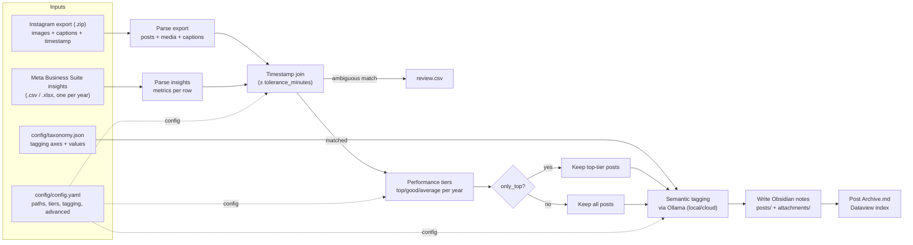

# IG2OBS

Turn your own Instagram export into a browsable Obsidian vault: one note per post, with metrics, performance tiers, and AI-assisted tags — built from two official Meta downloads. No app connected to your account, no token, no scraping.

<br clear="left">


## How it works

1. Instagram's own **"Download your information"** export gives you every post's images and captions.
2. Meta Business Suite's **content insights** export gives you the metrics (reach, likes, saves, ...) per post.
3. The script joins the two on publish timestamp, computes a performance tier per post (top X% of the year on whatever metric you pick), tags each caption's topic via a local LLM (Ollama), and writes it all out as Obsidian notes with Dataview queries ready to go.



## Requirements

- Python 3.11+
- [Ollama](https://ollama.com), running locally (free) — only needed for semantic tagging

## Setup

```bash
git clone <this-repo>
cd IG2OBS

python3 -m venv .venv
source .venv/bin/activate          # Windows: .venv\Scripts\activate
pip install -r requirements.txt

# only if your insights export is .xlsx (not needed for .csv):
pip install openpyxl

# for semantic tagging:
ollama serve                       # keep running in another terminal
ollama pull llama3.2:3b            # default model, small and fast
```

Copy the tracked templates to your personal, gitignored files:

```bash
cp config/config_schema.yaml config/config.yaml
cp config/taxonomy_schema.json config/taxonomy.json
```

## Getting the data

### 1. Instagram export (required)

From `accountscenter.instagram.com`: **Settings → Accounts Center → Your information and permissions → Download your information → Download or transfer information**, pick the account, then **Some of your information → Content**.

On the final screen:

| Option | Value | Why |
|---|---|---|
| Date range | **All time** | otherwise you lose half the archive |
| Format | **JSON** | the script can't read the HTML export |
| Media quality | **High** | max resolution Instagram will give you |

Meta takes a few hours to a couple of days and emails you a download link (it expires after some days). Drop the ZIP as-is into `data/ig-export/` — no need to extract it.

> **Large accounts may get an incomplete or split export.** If your notes end up mostly from one time period, the ZIP is likely missing media for the rest — check for multiple parts, or a separate media-only download. To merge one in: just add those files into the ZIP itself (any folder inside it works — the script searches the whole archive by filename if the exact path doesn't match) and keep `paths.ig_export` pointing at that ZIP. No need to extract anything by hand.

### 2. Insights export (optional)

Without this you still get the full archive, just without metrics or tiers.

From `business.facebook.com` → **Insights → Content**: filter on Instagram, set the widest date range, **Export data** (CSV or XLSX).

Meta caps this export to a short window (usually a year) — do one export per year and drop them all into `data/insights/`, any filename. The script auto-discovers every file in that folder; nothing to list by hand. Overlapping exports get deduplicated automatically.

The only required column is the publish date — the script recognizes several common header spellings; rename it to `Publish time` if yours is unusual.

## Configuration

### Command line

The script takes exactly one flag:

| Flag | Default | Meaning |
|---|---|---|
| `--config PATH` | `config/config.yaml` | Which YAML config file to load. Everything else is read from that file. |

### `config/config.yaml`

Start from `config/config_schema.yaml` (`cp config/config_schema.yaml config/config.yaml`). Four sections, every field below:

**`paths`**

| Key | Default | Required | Meaning |
|---|---|---|---|
| `ig_export` | — | **yes** | Path to the Instagram export: a `.zip` (used as downloaded) or an already-extracted folder. |
| `insights_dir` | — | **yes** | Folder containing the Meta Business Suite insight files (`.csv`/`.tsv`/`.xlsx`/`.xlsm`), one per year. Every matching file inside is auto-discovered. |
| `out` | — | **yes** | Output folder — becomes your Obsidian vault. Created if missing. |
| `cache` | `<out>/.ig_archive_cache` | no | Where the ZIP gets extracted to and where the tag cache (`tags_cache.json`) lives. |
| `taxonomy` | `config/taxonomy.json` | no | Path to the taxonomy file used for semantic tagging. |

**`tiers`**

| Key | Default | Meaning |
|---|---|---|
| `metric` | `engagement` | Which value ranks posts: any insights column (`reach`, `saves`, `likes`, `comments`, `shares`, `follows`, `impressions`), or one of two computed ones — `engagement` (sum of likes+comments+shares+saves) or `engagement_rate` (`engagement / reach × 100`, independent of page size/growth). |
| `top_percentile` | `25` | Percentile cutoff for the "top" tier, computed **separately for each calendar year** (a 2023 post is only ranked against other 2023 posts). `25` = best 25% of that year. Posts also get `good` (top 50%) or `average`; posts with no matching insights row get `no-data`. |

**`tagging`**

| Key | Default | Meaning |
|---|---|---|
| `model` | `llama3.2:3b` | Ollama model used to tag captions. Any locally-pulled tag, or one suffixed `-cloud` (needs `ollama signin`) for Ollama's cloud models. Prefer non-reasoning models (`llama3.2`, `mistral`) — reasoning models (`qwen3`, `deepseek-r1`) spend hundreds of hidden tokens "thinking" per call, which is pure latency here and can time out a batch. |
| `enabled` | `true` | `false` skips tagging entirely — no Ollama calls, posts get no semantic tags (they still get the `tier/*` tag and a note, if they qualify). |

**`advanced`**

Every key is optional; each falls back to the default below if omitted. These rarely need changing per run (unlike `tiers`/`tagging` above), but now live in config.yaml instead of being hardcoded.

| Key | Default | Meaning |
|---|---|---|
| `only_top` | `true` | Only posts in the `top` tier get written as a note. Posts with `good`/`average`/`no-data` tiers are skipped — including **every post from a year with no matching insights file**, since without insights a post has no metric and can't be ranked. Set `false` to write a note for every post regardless of tier. |
| `tolerance_minutes` | `90` | Max time difference allowed when matching an insights row to a post by publish timestamp. |
| `insights_tz` | `America/Los_Angeles` | Timezone the insights file's publish-time column is interpreted in — this is Meta Business Suite's own export default (Pacific Time), regardless of your account's timezone. Wrong value here is the #1 cause of a near-zero join match rate. |
| `tier_scope` | `year` | `year` computes tiers separately per calendar year (a 2023 post only competes with other 2023 posts). `global` compares every post against every other post regardless of year. |
| `attachments_dirname` | `attachments` | Name of the media subfolder inside the output vault. |
| `batch_size` | `15` | Captions sent per Ollama call. Lower it if a model times out on full batches. |

Two more knobs are env vars, not YAML, since they're about *where Ollama lives* rather than the run itself:

| Env var | Default | Meaning |
|---|---|---|
| `OLLAMA_HOST` | `http://localhost:11434` | Ollama server address. Point this at a remote/cloud endpoint if you're not using `ollama signin` + a `-cloud` model tag. |
| `OLLAMA_API_KEY` | unset | Sent as a Bearer token if set — only needed talking directly to a cloud endpoint, not a local `ollama signin`'d instance. |

`config/config_schema.yaml` and `config/taxonomy_schema.json` are the tracked templates — edit those (not your personal `config/config.yaml` / `config/taxonomy.json`) if you're contributing a default change.

### `config/taxonomy.json`

Start from `config/taxonomy_schema.json` (`cp config/taxonomy_schema.json config/taxonomy.json`). Used both to build the tagging prompt and to validate the model's answers — any value the model returns that isn't listed here gets dropped.

| Key | Required | Default | Meaning |
|---|---|---|---|
| `_note` | no | — | Free-text comment, ignored by the script. Any key starting with `_` is ignored as an axis. |
| `_instructions` | no | built-in generic prompt | List of strings (or one multi-line string) forming the system prompt's preamble — the persona and rules the model follows before seeing the taxonomy. |
| any other top-level key | — | — | Defines one **axis** (a tagging dimension, e.g. `topic`, `format`). Key name becomes the tag prefix (`topic/some-value`). |

Each axis is an object with:

| Field | Required | Default | Meaning |
|---|---|---|---|
| `values` | **yes** | `[]` | The closed list of allowed values for this axis. The model can only pick from these; anything else is discarded. |
| `description` | no | `""` | One-line explanation of what this axis captures, shown to the model in the prompt. |
| `multi` | no | `false` | Whether a post can have more than one value on this axis. `false` keeps at most the first value the model returns. |

## Run

The script takes only `--config`; every other choice (tag or not, which model, local or cloud) is made in `config.yaml`, not on the command line.

**Basic run**, reading `./config/config.yaml`:

```bash
source .venv/bin/activate
python ig_obsidian_archive.py
```

**A different config file** (e.g. a second Instagram account):

```bash
python ig_obsidian_archive.py --config config/other-account.yaml
```

**Without semantic tagging** (fastest, no Ollama needed at all) — set in `config.yaml`:

```yaml
tagging:
  enabled: false
```

```bash
python ig_obsidian_archive.py
```

**With tagging, local model** — a model pulled with Ollama running on your own machine, free, no account needed:

```yaml
tagging:
  enabled: true
  model: llama3.2:3b
```

```bash
ollama serve                 # keep running in another terminal
ollama pull llama3.2:3b      # once
python ig_obsidian_archive.py
```

**With tagging, Ollama cloud** — the model runs on Ollama's servers, still free, no local GPU/server needed; the model tag just needs a `-cloud` suffix:

```yaml
tagging:
  enabled: true
  model: qwen3:235b-cloud
```

```bash
ollama signin                # once, opens a browser to log in
python ig_obsidian_archive.py
```

Tags are cached in `<out>/.ig_archive_cache/tags_cache.json` (keyed by caption content, not by post), so rerunning after a config tweak doesn't re-tag posts it already processed — only new or edited captions hit Ollama. The export itself is a snapshot, not a live sync — to pick up new posts, redo the download and rerun.

Every run writes a **fresh, timestamped** output folder (`obsidian-output-20260812-153000/`, see [Output](#output)) so an old archive is never silently overwritten; the extracted export and the tag cache, on the other hand, are reused across runs so reruns stay fast.

## How notes are composed

One post → one Markdown note, written by `write_notes()`:

1. **Filename**: `<publish-date>-<slug-of-the-first-caption-line>.md` (hashtags stripped, ASCII-folded, 60 chars max) — readable and stable across reruns of the same post.
2. **Media**: every image/video in the post is copied into `attachments/` and embedded at the top of the note with Obsidian's `![[filename]]` syntax (carousels get all their media embedded, numbered `-01`, `-02`, ...).
3. **Frontmatter**: publish date/time/year, post type (`single`/`carousel`), the Instagram permalink (if matched), the performance tier, every numeric metric from the insights export, and a `tags:` list built from `post`, one `axis/value` entry per semantic tag, and `tier/<tier>`.
4. **Body**: an H1 title (the caption's first line), the embedded media, then the full caption inside a ` ```text ` fenced block — deliberately fenced so its hashtags don't get parsed as real Obsidian tags and pollute the tag index, and so it's one click to copy for reposting.
5. **Review warning**: if the export↔insights join was ambiguous for this post, a `> [!warning]` callout is added explaining why metrics might be missing.

Alongside the posts, `write_index()` generates `Post Archive.md` — a single note with ready-to-run Dataview queries (best of each year, coverage per taxonomy axis, content gaps, old-but-strong posts worth reposting) that adapt automatically to whatever axes your `taxonomy.json` defines.

## Inspecting the output in Obsidian

1. Open Obsidian → **Open folder as vault** → pick the timestamped `obsidian-output-.../` folder from this run.
2. Install the **Dataview** plugin (Settings → Community plugins → Browse → search "Dataview" → Install → Enable). The queries in `Post Archive.md` don't render without it.
3. Open `Post Archive.md` first — it's the entry point, with tables/lists for top posts, per-axis coverage, and content gaps.
4. Browse `posts/` directly for individual notes, or click through from a Dataview table row.
5. Use the tag pane (or `#axis/value` style search) to filter by any taxonomy axis — every axis from `taxonomy.json` becomes a real Obsidian tag.
6. If `review.csv` was generated, open it in a spreadsheet app; the corresponding notes carry a visible warning callout so they're easy to spot inside the vault too.

## Output

```
obsidian-output-20260812-153000/   ← one fresh folder per run, timestamped
├── Post Archive.md      ← index note with ready-to-use Dataview queries
├── posts/
│   └── 2024-01-26-first-line-of-the-caption....md
├── attachments/
│   └── 2024-01-26-first-line-of-the-caption....jpg
└── review.csv            ← only if the join left ambiguous cases

obsidian-output/.ig_archive_cache/   ← extracted export + tag cache, reused across runs
```

Each note:

```yaml
---
date: 2024-01-26
year: 2024
type: single
tier: top
reach: 78000
saves: 3300
engagement_rate: 19.2
tags:
  - post
  - topic/some-value
  - format/some-other-value
  - tier/top
---
```

**The join can get it wrong.** Export and insights share no ID, only a timestamp. Ambiguous matches aren't guessed — they land in `review.csv` with a warning on the affected note, metrics left empty.

## Customizing the tag taxonomy

Schema and fields are in the `config/taxonomy.json` reference above. No code changes needed — the Dataview queries in the index note adapt automatically to whatever axes it finds. A few practical tips:

- A value earns its place if you'd actually filter by it one day; a 40-value axis is one nobody remembers to use.
- If the model keeps getting a case wrong, add a rule to `_instructions` instead of hand-fixing notes.
- After editing values, delete `<out>/.ig_archive_cache/tags_cache.json` to force a re-tag — otherwise already-tagged posts keep their old tags.

## License

MIT (or your choice — update this section before publishing).
